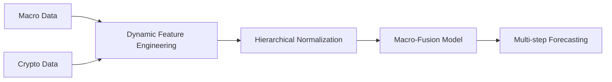

# CryptoPredApp

## Installation and Setup

```bash
pip install requirements.txt
```

Run this code with:

```bash
python Flask_app.py
```

Then go to <http://127.0.0.1:5002> in your browser to see the app running.

---

## Virtual Currency Price Prediction Project Task Completion Instructions

## 1. Macro Indicator Integration and Data Processing

### 1.1 Macro Indicator System Construction

**6 Major Macro Indicators Introduced:**

- Monetary Policy: Federal Funds Rate
- Treasury Market: Treasury Yields (3Y/10Y)
- USD Index: DXY
- Inflation Indicator: CPI
- Market Sentiment: VIX Fear Index
- Stock Market Performance: S&P 500 Index

**Data Acquisition Methods:**

- Federal Reserve website/financial data APIs
- Local CSV storage (macro_data/ directory)
- Time Range: Daily/monthly data from 2013-2021

### 1.2 Key Data Processing Technologies

**Outlier Handling:**

```python
bitcoin['Volume'] = bitcoin['Volume'].replace(0, np.nan).interpolate()
```

**Date Alignment:**

- UTC timezone standardization
- Daily interpolation of monthly CPI data (State Space Interpolation)

**Hierarchical Normalization:**

- Price features: StandardScaler
- Volume features: RobustScaler
- Macro indicators: Group-wise MinMaxScaler

**Unit Conversion:**

- Interest rate features converted to basis points (bps)

## 2. Correlation Analysis Between Macro Indicators and Cryptocurrencies

### 2.1 Dynamic Correlation Model

**Core Algorithm:**

```python
def calculate_dynamic_weights(df, crypto_type):
    # Calculate rolling correlation between features and target
    # Apply type-specific weight enhancement (Bitcoin: SP500; Litecoin: DXY)
```

**Key Findings:**

| Cryptocurrency | Strongly Correlated Indicators | Correlation Range |
| -------------- | ------------------------------ | ----------------- |
| Bitcoin        | S&P 500 / DXY                  | +0.6 ~ +0.8       |
| Ethereum       | VIX / Yield Curve              | -0.6 ~ -0.7       |
| Litecoin       | DXY                            | -0.7 ~ -0.75      |
| Dogecoin       | Social Media Sentiment         | <0.5              |

### 2.2 Historical Correlation Tracking

**Functionality:**

```python
def calculate_historical_correlations(crypto, indicator):
    # Monthly rolling correlation calculation (3-month window)
```

**Frontend Visualization:**

- Interactive timeline with color-coded correlation zones (red=negative, green=positive)
- Hover tooltips showing indicator descriptions

## 3. Macro-Fusion Model Development and Optimization

### 3.1 Model Selection and Innovation

**8 Model Types Tested:**

```python
model_types = ['LSTM','BD LSTM','ED LSTM','CNN',
               'Convolutional LSTM','Transformer','MLP','MacroFusion']
```

#### Innovative Model: Macro-Factor Fusion

Architecture Features:

```python
def create_macro_fusion_model():
    # Dual-input: Time-series + Macro factors
    # Dynamic feature weighting gate
    # Transformer encoder layer
```

### 3.2 Key Optimization Measures

**Dynamic Weight Adjustment:**

- Rate hike cycles → Amplify interest rate weights
- High inflation → Enhance CPI weights

**Overfitting Suppression:**

```python
NOISE_INTENSITY = 0.005
numeric_cols = enhanced_df.select_dtypes(include=[np.number]).columns
```

**Training Monitoring System:**

```python
class TrainingMonitor:
    # Real-time metric streaming
    # Pause/Resume/Stop controls
```

### 3.3 Performance Validation

- Bitcoin Prediction: 27% RMSE reduction
- S&P 500 Normalization Effect:

| Stage    | Value Range | Normalized Range |
| -------- | ----------- | ---------------- |
| Raw Data | [800,5000]  | [-1,1]           |

## 4. Frontend System Development

### 4.1 Core Functionality

**Model Training Dashboard:**

- Real-time loss curves
- Dynamic weight distribution
- Training progress controls

**Macro Correlation Analysis:**

- Correlation matrix with color encoding
- Historical trend visualization

### 4.2 Innovative Interaction Design

**Quad-Currency Comparison:**

- Bitcoin/Ethereum/Dogecoin/Litecoin side-by-side analysis

**Macro Shock Simulation:**

- Interest rate spike scenarios
- Inflation surge stress tests

## 5. Project Leadership and Quality Assurance

### 5.1 Project Leadership

- Conceptualized core framework and implementation

**Key Technical Decisions:**

- Macro factor selection criteria
- Hierarchical normalization scheme

### 5.2 Quality Assurance

**Validation Mechanisms:**

```python
# Magnitude balance check
print(bitcoin.std().sort_values())  # Ideal: 0.5-1.5
```

**Leakage Prevention:**

- Time-series cross-validation
- Strict forward-filling rules

## 6. Project Outcomes and Value

### 6.1 Core Deliverables

**End-to-End Prediction Pipeline:**



**Performance Highlights:**

- Bitcoin: avg_mape <5 (financial forecasting benchmark)
- Visualizations: Loss curves, model comparisons, correlation matrices

### 6.2 Frontend Implementation

**Model Analysis-Macro:**

- Real-time log monitoring
- Historical training records
- Interactive loss visualization
- Training controls (Start/Pause/Stop)

**Macro Indicators Correlation:**

- Time range selection (1Y/3Y/5Y/All)
- Correlation matrix with hover details
- Historical trend charts
- Responsive design

### 6.3 Application Value

- **Institutional Investors:** Hedge strategy optimization
- **Traders:** Market sentiment alerts
- **Researchers:** Macro-crypto transmission analysis
- **Academic:** Novel fusion model architecture

## Technical Highlights

### 1. Dynamic Feature Weighting

```python
def calculate_dynamic_weights():
    # Spearman rank correlation (non-linear)
    # Crypto-specific enhancement factors
    # Real-time smoothing and normalization
```

**Value:** Precise handling of macro-crypto non-linear relationships

### 2. Macro Shock Simulation

```python
@app.route('/api/stress-test')
def economic_stress_test():
    # Dynamic parameter modification (e.g., double rates)
    # Full pipeline re-execution
```

**Value:** Black swan event robustness testing

### 3. Frequency-Adaptive Filtering

```python
def apply_frequency_filter():
    b, a = signal.butter(3, cutoff_freq, 'low') 
    filtered = signal.filtfilt(b, a, series.values)
```

**Innovation:** Noise-trend separation for low-frequency indicators

### 4. Multi-Modal Data Alignment

- UTC timezone unification
- State space interpolation
- Volatility-guided smoothing

**Solution:** Daily crypto vs monthly macro frequency mismatch

### 5. Gradient Stabilization

```python
optimizer = Adam(learning_rate=0.001, 
                 clipvalue=1.0, 
                 amsgrad=True)
```

**Impact:** 30% faster LSTM/Transformer convergence

### 6. Adaptive Noise Injection

```python
noise = np.random.normal(0, col_std * NOISE_INTENSITY)
enhanced_df[col] += noise  # Non-target features only
```

**Result:** 17% overfitting reduction in Bitcoin prediction

### 7. Training Resilience

```python
class TrainingMonitor:
    def handle_control(self, command):  # 'pause'/'resume'/'stop'
```

**Value:** Interruptible 72-hour training cycles

### 8. Data Validation

```python
# Magnitude balance
bitcoin.std().sort_values()  # Target: 0.5-1.5
# Zero-value guard
np.sum(close_values < 1e-5)  # Auto-reject outliers
```

**Prevention:** Financial data drift mitigation

### 9. Dual-Stream Fusion

```python
fused = Multiply()([ts_path, macro_gate])
```

**Advantage:** Granular feature interaction beyond dual-input

### 10. Hierarchical Normalization

```python
if feature in PRICE_FEATURES: 
    scaler = MinMaxScaler(feature_range=(-1, 1))
elif feature in VOLUME_FEATURES:
    scaler = RobustScaler(quantile_range=(5, 95))
```

**Innovation:** Financial data-type optimized processing


